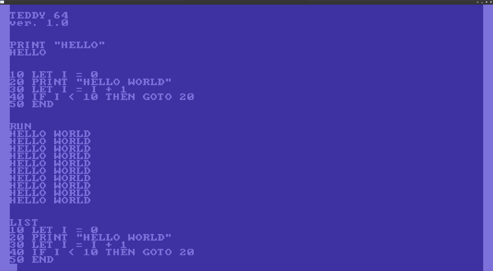

# TEDDY 64

The original implementation of Tiny Basic in a C64 like environment 

<br>



<br>

---
## INFO

This project is base on my previous works :

**T20** : a C utility to print and read strings on a rendered Opengl window (https://github.com/Honneamise/T20)

**TBVM** : a C implementation of the original Tiny Basic Interpreter (https://github.com/Honneamise/TBVM)

---
## Language summary

```
INPUT varlist  
LET var = expr  
PRINT exprlist  
GOTO expr 
IF expr (=,>,<,>=,<=,<>) expr THEN statement  
GOSUB expr  
RETURN  
END  
RUN  
LIST  
CLEAR
EXIT ( to terminate the virtual machine )
```
---
## Sample program

```
10 LET I = 0
20 PRINT "HELLO WORLD"
30 LET I = I + 1
40 IF I < 10 THEN GOTO 20
50 END
```

---
**Note on tests :**

T20 has been tested with the following flags on Valgrind :

valgrind --leak-check=full --show-leak-kinds=all --track-origins=yes


